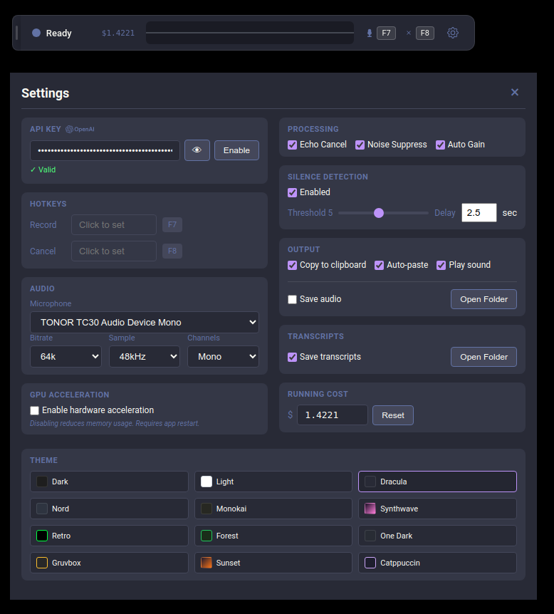
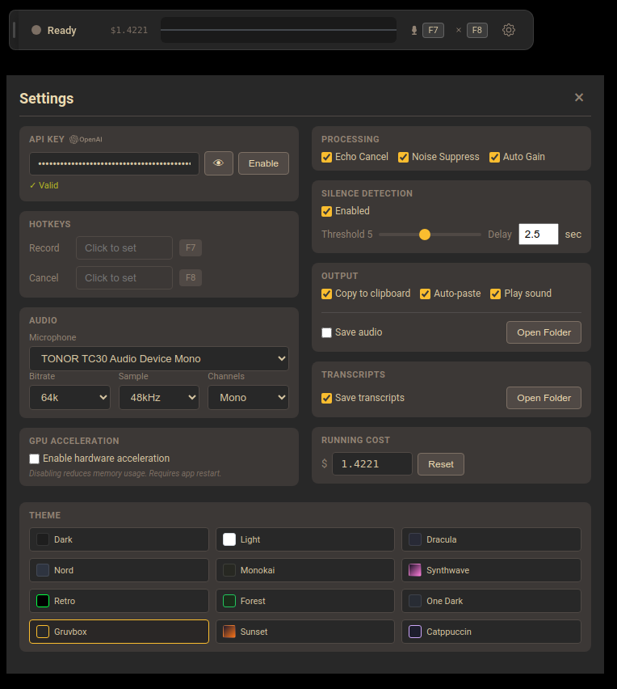

# Superduper Whisper

A desktop app for voice-to-text transcription using OpenAI's Whisper API. Press a hotkey, talk, and the transcribed text gets copied to your clipboard and optionally pasted into whatever you're working in.

I built this because I wanted a fast, always-visible dictation tool that stays out of the way. It sits as a small floating bar on your screen, shows a waveform while you talk, and handles the rest.


*Recording in progress — live waveform, timer, cost tracker, and hotkey hints.*



*Settings panel (Dracula theme) — API key, hotkeys, audio config, silence detection, themes, and more.*



*Same settings panel in Gruvbox — one of 12 built-in themes.*

|  |  |
|:---:|:---:|
| *Collapsed mini bar (Dracula)* | *Collapsed mini bar (Gruvbox)* |

## What it does

- **Hotkey-triggered recording** — Default is `Ctrl+Shift+Space` to start/stop, `Escape` to cancel. Fully configurable.
- **Whisper API transcription** — Sends recorded audio to OpenAI's Whisper API (`whisper-1` model) and gets text back.
- **Clipboard + auto-paste** — Transcribed text is copied to your clipboard. With auto-paste enabled, it types it out for you.
- **Floating bar UI** — A small, frameless, always-on-top bar with a live waveform visualizer. Can be collapsed to a mini view and dragged anywhere on screen.
- **System tray** — Tray icon shows current state (idle, recording, transcribing, error). Right-click for quick access to settings and toggle.
- **Silence detection** — Configurable silence threshold and pause delay. Pauses recording automatically during silence and resumes when you start talking again.
- **Themes** — 12 built-in themes: dark, light, dracula, nord, retro, monokai, synthwave, forest, onedark, gruvbox, sunset, catppuccin.
- **Cost tracking** — Tracks cumulative Whisper API costs (currently $0.006/minute).
- **Transcript & audio saving** — Optionally save transcription text and/or raw audio files locally.
- **Audio settings** — Configurable bitrate, sample rate, channels, echo cancellation, noise suppression, auto gain.
- **GPU acceleration toggle** — Can be disabled in settings if you're running into rendering issues.

## Requirements

- **Node.js** (v18+)
- **npm**
- An **OpenAI API key** with access to the Whisper API

## Setup

```bash
git clone https://github.com/jhargis/superduper-whisper.git
cd superduper-whisper
npm install
```

On first run, the app will open the settings panel so you can enter your OpenAI API key.

## Running

```bash
npm start
```

This builds the TypeScript and launches the Electron app.

For development with auto-rebuild:

```bash
npm run dev
```

## Installing as a desktop app (Linux)

The included installer creates a `.desktop` entry so the app shows up in your application menu.

```bash
./installers/install-linux.sh
```

To remove it:

```bash
./installers/uninstall-linux.sh
```

After installing, you may need to restart your desktop environment for the menu entry to appear. On Cinnamon, press `Alt+F2` and type `r`. On GNOME, log out and back in.

## Platform support

This was built as a personal tool and primarily runs on **Linux** (Debian-based distros with XDG). That's where it's tested and used daily.

**macOS** — The app itself runs fine. The installer script (`installers/install-macos.sh`) doesn't work yet.

**Windows** — Completely untested. The Electron stack should work in theory, but no promises.

## Configuration

Settings are stored in:

| Platform | Path |
|----------|------|
| Linux | `~/.config/superduper-whisper/settings.json` |
| macOS | `~/Library/Application Support/superduper-whisper/settings.json` |
| Windows | `%APPDATA%/superduper-whisper/settings.json` |

Transcripts and audio recordings are saved in subdirectories of the same config folder.

## How it works

The app is built with Electron. The main process handles global hotkey registration, system tray management, settings persistence, and API calls to OpenAI. The renderer process manages the overlay bar UI, audio recording via the browser's MediaRecorder API, and the waveform visualizer.

When you press the record hotkey, the renderer starts capturing audio from your microphone. When you press it again (or silence detection kicks in), the audio is sent to the main process, which forwards it to the Whisper API. The transcribed text comes back, gets copied to your clipboard, and optionally pasted.

## Author

[Jay Hargis](https://github.com/jhargis)

## License

MIT
